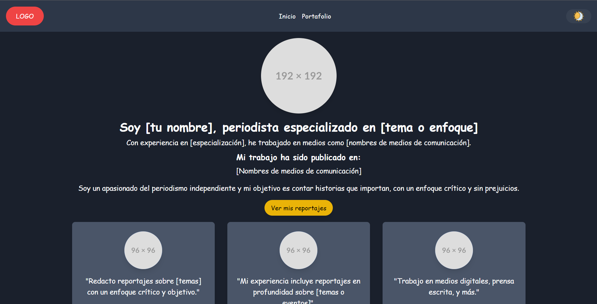
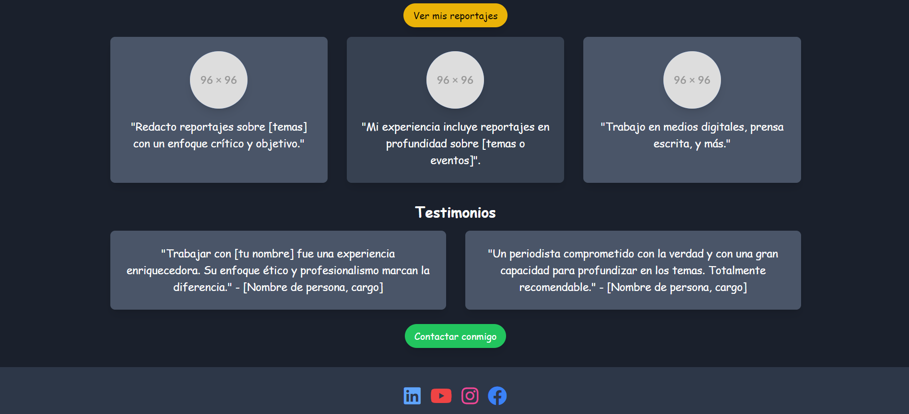
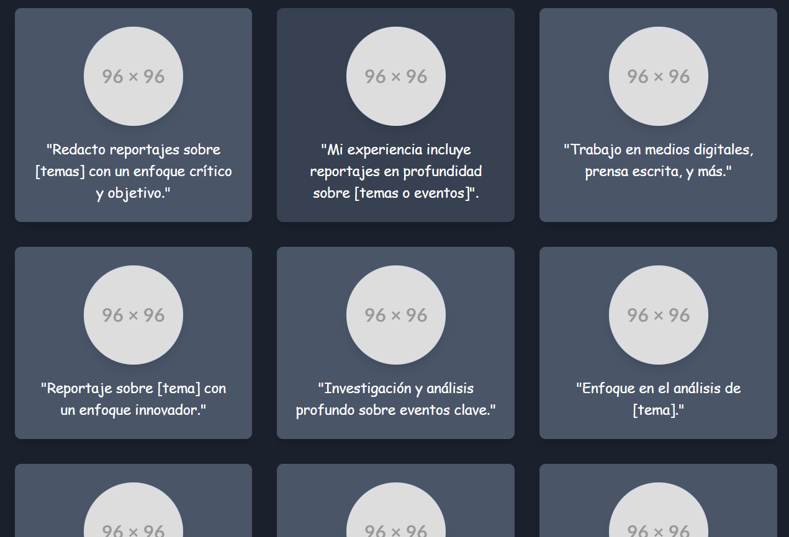

# Portafolio de Periodista

Este proyecto es un portafolio digital diseñado para un periodista, que busca destacar su experiencia profesional, trabajos publicados y testimonios relevantes. Fue construido con un diseño moderno y responsivo para ofrecer una navegación intuitiva y atractiva.

## Captura de Pantalla




## Características
- **Información Personalizada:** Permite destacar el nombre, especialización y experiencia del periodista.
- **Enlaces a Trabajos Publicados:** Sección para resaltar los medios donde se han publicado los reportajes.
- **Testimonios:** Espacio para mostrar comentarios positivos de colegas, clientes o empleadores.
- **Interfaz Intuitiva:** Navegación clara con menús para acceder a secciones como "Inicio" y "Portafolio".
- **Responsivo:** Diseño adaptado para verse bien en dispositivos móviles, tabletas y computadoras.

## Tecnologías Utilizadas
- **HTML5:** Estructura del sitio web.
- **CSS3:** Diseño y estilos, incluyendo el uso de colores y fuentes personalizadas.
- **JavaScript (Opcional):** Para funcionalidades interactivas.
- **Bootstrap (Opcional):** Diseño responsivo y componentes predefinidos.

## Estructura del Proyecto
├── index.html # Página principal del portafolio ├── styles.css # Estilos personalizados ├── assets/ │ ├── images/ # Imágenes utilizadas en el portafolio │ ├── icons/ # Íconos sociales │ └── README.md # Archivo de documentación del proyecto.


## Cómo Usar Este Proyecto
1. Clona este repositorio:
   ```bash
   git clone https://github.com/sergioquirogab/landingPage.git
